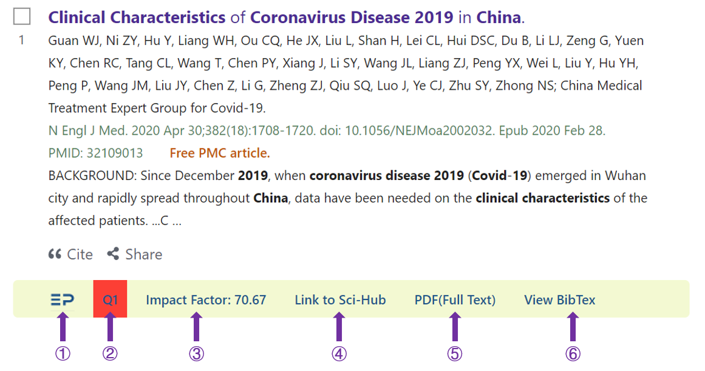
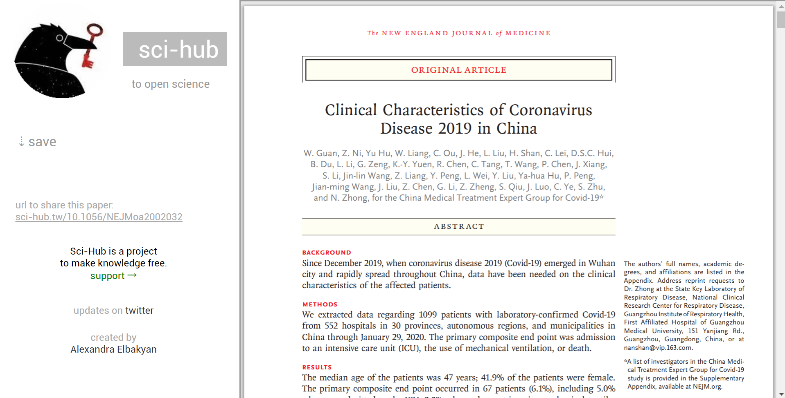
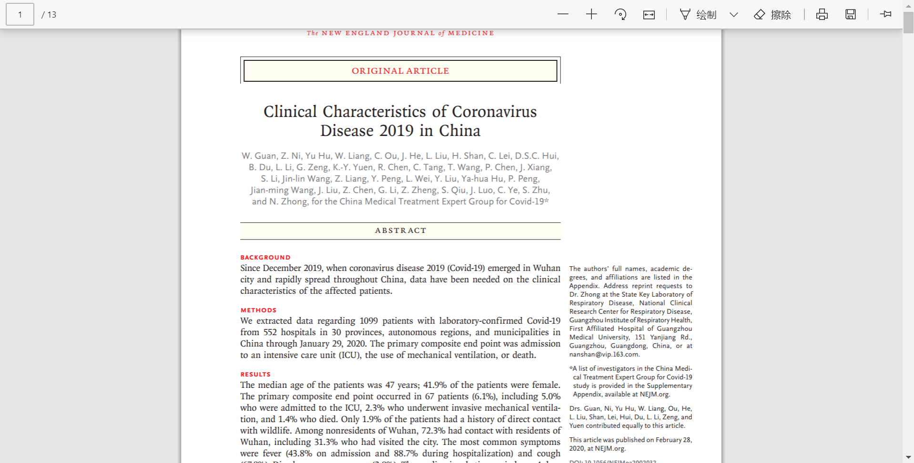
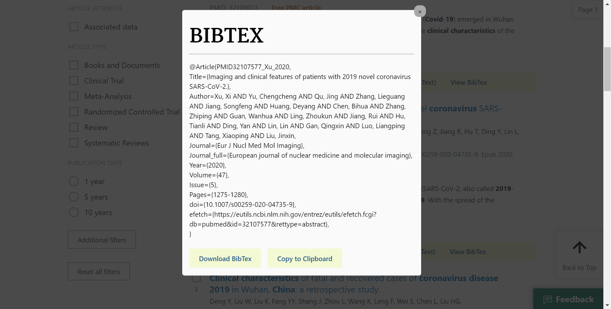
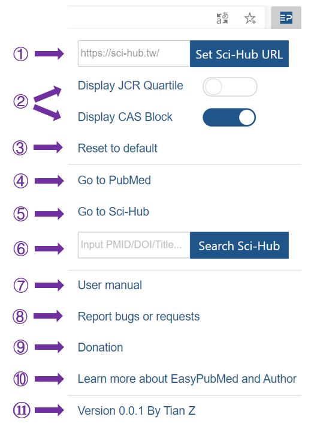

<left></left>

# EasyPubMed使用说明

**EasyPubMed使新版PubMed更好用**

- [功能特色](#功能特色)
- [安装](#安装)
- [功能展示](#功能展示)
  - [EasyPubMed工具条](#easypubmed工具条)
  - [弹出页面](#弹出页面)
- [数据来源](#数据来源)
- [声明](#声明)
- [错误报告及建议](#错误报告及建议)
- [捐赠](#捐赠)
- [开发故事](#开发故事)
- [作者](#作者)

> 提示: 同时按住Ctrl键并单击相应的链接可在新标签页打开此链接

## 功能特色

- 特色工具条，专为新版PubMed设计

- 极速加载：采用本地数据库，平均加载时间<0.1s

- 一键点击从Sci-Hub获取全屏全文PDF

- 显示杂志影响因子

- 显示杂志JCR分区或中科院分区

- 一键获取BibTex格式文献信息

<a href="#top">回到顶部</a>

## 安装

浏览器支持: Chrome, Edge

1. 下载扩展插件: [EasyPubMed](h)

<a href="#top">回到顶部</a>

## 功能展示

### EasyPubMed工具条

**安装EasyPubMed后，每篇文献下方将会出现EasyPubMed工具条**

1. EasyPubMed图标：链接到EasyPubMed在Github上的主页

2. 显示杂志JCR分区或中科院分区（可在[弹出界面](#option)设置）

   - JCR分区: 采用最新2019年 *Journal Citation Reports*数据，所显示的分区为该杂志在所用学科类别（包含SSCI和SCIE）中的最佳排名。 比如，该杂志在A学科中排名Q1，在B学科中排名Q3，那么依据其最佳排名该杂志被标注为Q1。不同分区杂志采用不同颜色标注，Q1标注为红色，Q1标注为黄色，Q3标注为绿色，Q4标注为灰色。NA表示该杂志未被收录。

    

   - CAS分区：采用2019年12月26日发布的中科院（CAS）文献情报分区表，所显示的分区为该杂志在所用学科类别中的最佳排名。我们采用B1、B2、B3、B4表示该杂志在1区、2区、3区、4区。不同分区杂志采用不同颜色标注，B1标注为红色，B1标注为黄色，B3标注为绿色，B4标注为灰色。NA表示该杂志未被收录。

    

   - JCR分区与CAS分区差异请参见 https://zhuanlan.zhihu.com/p/78144183

3. 显示杂志影响因子:  采用最新2019年 *Journal Citation Reports*数据，NA表示该杂志未被收录。

4. 链接至该文章所对应的Sci-Hub页面。如果未找到该杂志doi，此链接将失活变为灰色。

   

5. 全屏显示全文PDF，这是通过进一步分析Sci-Hub页面所获得的全屏PDF链接，可能需要几秒钟加载时间。如果可以获取全文PDF，此链接将被激活并显示'PDF(Full Text)‘，否则连接将变成灰色并显示'PDF(NOT FOUND)'。

      

6. 用BibTex格式展示该文章信息。该信息通过访问NCBI数据库分析得到，可能需要几秒钟时间，如果获取失败将有提示出现。可以点击下方按钮选择保存此信息为txt文件或复制到剪贴板。下载文件的文件名及该文章BibTex编号为：PMID+该文章PMID号+一作姓氏+出版年份，如'PMID32109013_Guan_2020'。

      

### 弹出页面

     

左键点击浏览器右上角深蓝色EP（EasyPubMed）按钮将会出现弹出页面，您可在此页面进行参数设置、快捷功能访问并了解EasyPubMed使用。

1. 设置默认Sci-Hub地址，默认为 'https://sci-hub.tw/'. 合法的Sci-Hub地址需由 'https://' 或 'http://' 起始并由 "/"结尾.
2. 选择展示JCR分区或CAS分区。如果一种方法被激活，另一种分区方法将自动关闭。默认采用JCR分区。
3. 恢复到默认设置即Sci-Hub地址： 'https://sci-hub.tw/ 并展示JCR分区.
4. 链接到PubMed首页: https://pubmed.ncbi.nlm.nih.gov/
5. 链接到您设置的Sci-Hub首页：默认为 'https://sci-hub.tw/
6. 搜索Sci-Hub网站。您可以在此处输入所寻找文章的PMID号、DOI或论文题目，在此处搜索与在Sci-Hub首页搜索所得结果是一致的。
7. 链接到EasyPubMed使用手册
8. 链接到EasyPubMed错误报告及建议页面
9. 链接到捐助页面
10. 了解扩展开发故事及作者
11. EasyPubMed版本号及作者信息

<a href="#top">回到顶部</a>

## 数据来源

采用杂志唯一的ISSN编号将Pubmed数据库杂志信息、2019年JCR报告、2019年12月26日发布的中科院（CAS）文献情报分区表合并。结果已经过手动核查。但由于JCR及CAS报告可能错误的将eISSN用作ISSN，因此合并过程可能出现错误。如果您发现数据有误，您可以通过发送邮件到<easypubmed.project@gmail.com>或在<https://github.com/naivenaive/EasyPubMed/issues>中发起新提议以将错误信息报告给我们. 

我们采用Pubmed杂志缩写获取各杂志的影响因子、JCR分区及CAS分区。由于NLM的问题（已将此问题汇报给NLM），以下杂志使用了相同的Pubmed杂志缩写，使用时请引起注意。

- Pubmed杂志缩写: Front Phys
   - Frontiers of Physics (ISSN:2095-0462; IF:2.483; Q2; B2) 
   - Frontiers in Physics (ISSN: 2296-424X; IF:1.895; Q2; B3) 
- Pubmed杂志缩写: Microbiology 
   - Microbiology (Reading, England) (ISSN: 1350-0872; IF:1.922; Q4; B4)
   - Microbiology (ISSN: 0026-2617; IF:1.027; Q4; B4)

<a href="#top">回到顶部</a>

## 声明

EasyPubMed及其作者不对此扩展所提供数据（包括JCR杂志影响因子、杂志JCR分区、杂志CAS分区、文章BibTex信息）准确性及 Sci-Hub全文数据来源及准确性负责。如果您希望获取JCR影响因子、杂志JCR分区，请访问JCR官方网站: https://jcr.clarivate.com/. 如果您希望获取中科院（CAS）文献情报分区，请访问: http://www.fenqubiao.com/.

<a href="#top">回到顶部</a>

## 错误报告及建议

我们正在为此扩展增添更多功能，如果您有想法或建议请告知我们。如果您发现数据错误请告知我们。您可以通过发送邮件到<easypubmed.project@gmail.com>或在<https://github.com/naivenaive/EasyPubMed/issues>中发起新提议以将错误信息报告给我们。非常希望得到您的反馈。

<a href="#top">回到顶部</a>

## 捐赠

EasyPubMed是完全免费的。此扩展开发过程需要耗费很大的时间和精力，如果您觉得此扩展有用、好用，能否请作者吃一份烤冷面（10元），喝一杯咖啡（20元），一盘锅包肉（50元）或一顿美味的海底捞（100元）呢？我将深受鼓舞并尽力维护好此项目。

<left>

<a href="#top">回到顶部</a>

## 开发故事

我是一名医学生，经常使用Pubmed查阅文献。几年前，我发现了名为Pubmedy的扩展插件。该插件帮助我节省了大量查阅全文的时间。尽管此插件非常好用，但是2018年就停止更新了。2020年5月Pubmed停止了对旧版本的支持并以新版本替代，自此Pubmedy插件再也不能使用。在使用新版本Pubmed过程中，没有此插件的帮助我感觉很不适应。此外，我经常需要用到BibTex格式的文件，而Pubmed并不直接提供此种格式的下载。因此，我决定制作一个为新版Pubmed设计的新插件。

作为一名医学生，我对于编程仅限于用R、Python进行数据处理，我完全不了解如何编写这样的插件。在我下定决心后，我开始自学 JavaScript，CSS及 HTML前端开发知识。以原Pubmedy插件作为老师，结合自学内容在克服了重重困难后成功制作了该插件。它的性能稳定，加载速度很快。希望您能觉得此插件有用。当然，由于水平有限，制作过程中难免会出现一些bug，希望您可以将您的体验及所发现的错误报告给我easypubmed.project@gmail.com，我将非常感激。

<a href="#top">回到顶部</a>

## 作者
<left>

**田振**

**经历**

- 2010-2015：上海交通大学医学院就读临床医学

- 2015-2018：复旦大学上海医学院就读；华山医院皮肤科住院医生

- 2018-今：自由职业，等待机会与希望，愿神保佑

**兴趣爱好**

- 聊人生和希望
- 皮肤病诊疗 (银屑病、痤疮、脱发等), 医疗美容 (护肤品、激光等)
- 医学科普
- 医学统计及生物信息学，使用R、Python处理医学相关数据
- 最近喜欢前端编程（JavaScript，CSS，HTML）开发扩展

>如果您和我有相似的兴趣，或者您遇到困难觉得我的兴趣爱好可能对您有所帮助，或者您有一些兼职工作如医学材料翻译、医学科普制作等我可以帮助完成，亦或您单纯想同我聊一聊人生和希望，欢迎与我联系。

**联系方式**

- Email: tianzhenwork@outlook.com
- 知乎: https://www.zhihu.com/people/naivenaive

<a href="#top">回到顶部</a>
