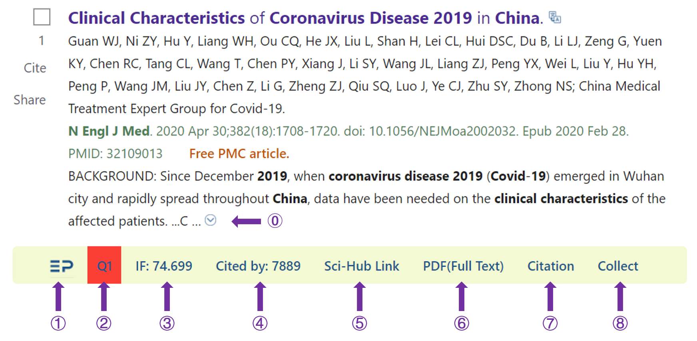
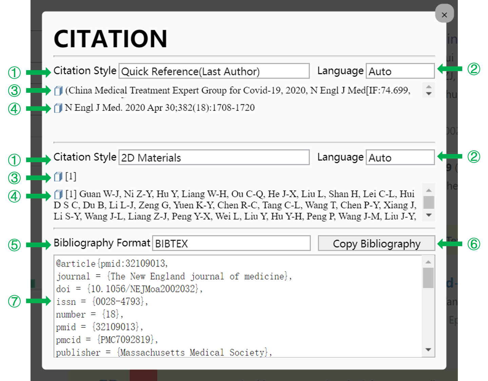
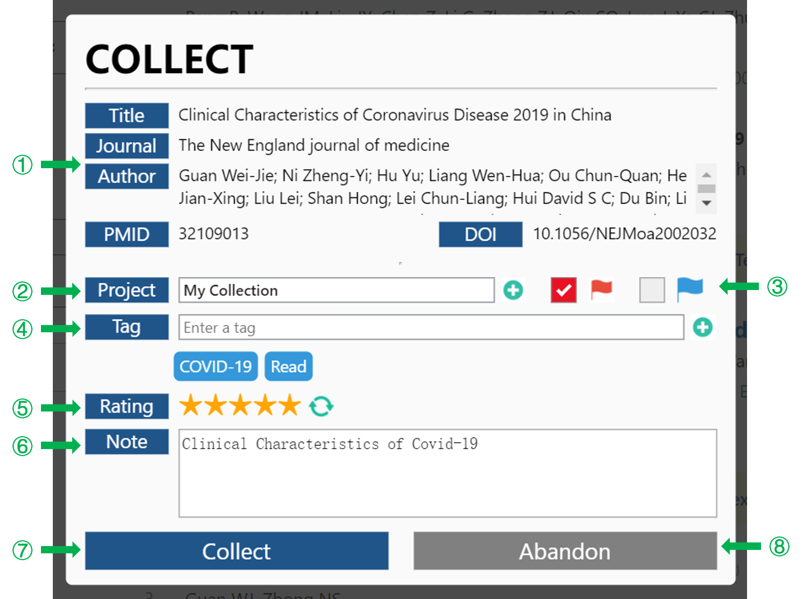
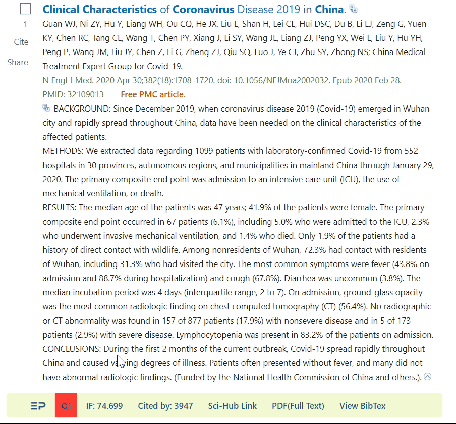
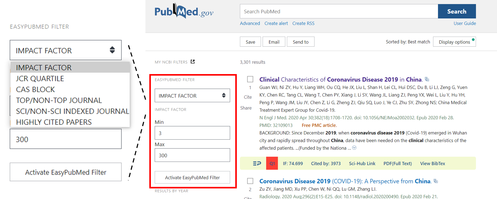
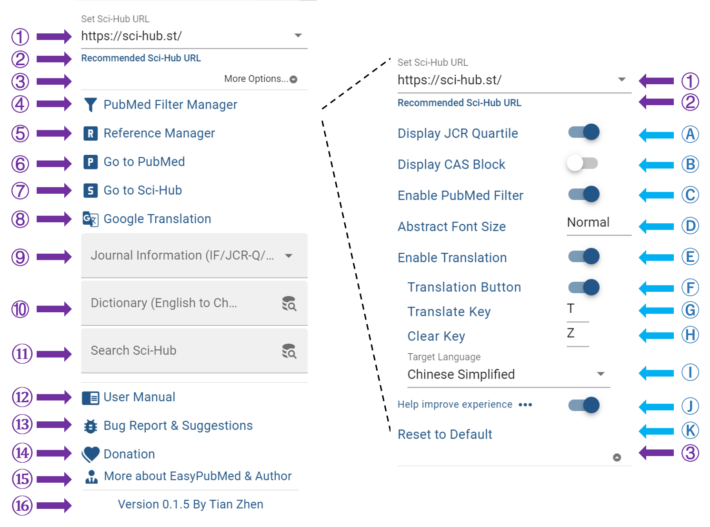
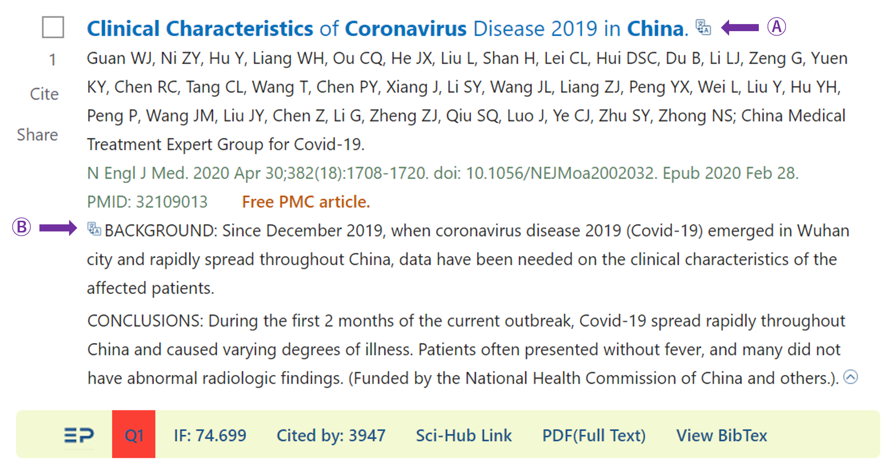
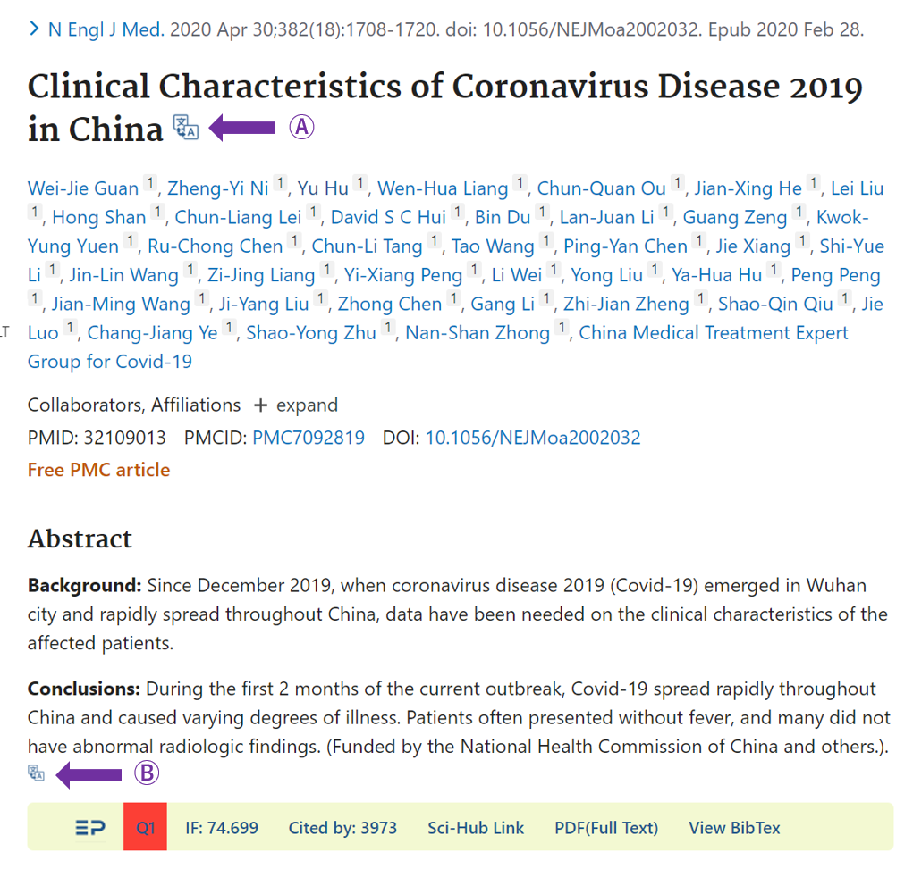

<left></left>
 

# EasyPubMed 

**EasyPubMed使新版PubMed更好用**

[**EasyPubMed使用说明(中文版)**](https://github.com/naivenaive/EasyPubMed/blob/master/EasyPubMed%E4%BD%BF%E7%94%A8%E8%AF%B4%E6%98%8E.md)

[**如Github网站图片加载出现问题，可访问知乎获取相同内容**](https://zhuanlan.zhihu.com/p/150317440)

> 更新至Version 0.1.7（2021.7）：[更新日志](https://github.com/naivenaive/EasyPubMed/blob/master/%E6%9B%B4%E6%96%B0%E6%97%A5%E5%BF%97.md)
> - 修复几处bug
> 
> 更新至Version 0.1.6（2021.7）：[更新日志](https://github.com/naivenaive/EasyPubMed/blob/master/%E6%9B%B4%E6%96%B0%E6%97%A5%E5%BF%97.md)
> - 使用2021年JCR数据（最新）及2020年中科院分区（最新）
> 
> 更新至Version 0.1.5（2021.6）：[更新日志](https://github.com/naivenaive/EasyPubMed/blob/master/%E6%9B%B4%E6%96%B0%E6%97%A5%E5%BF%97.md)
> - 文献管理助手（Reference Manager）
> - 增加PDF翻译功能
> - EasyPubMed工具条增加引用（Citation）和收藏（Collect）功能
> - 使用最新JCR及中科院分区数据（2020年）
> - 修复多个错误：如干扰网站弹窗、部分PubMed页面不显示EasyPubMed工具条

> **寻找合作伙伴**：为了让更多国家科研工作者使用此插件，**现需将EasyPubMed使用说明翻译为英文版本**。但由于本人时间、精力及水平有限，无法独自完成EasyPubMed使用说明英文翻译工作。如果您有兴趣帮助翻译EasyPubMed使用说明，请联系<easypubmed.project@gmail.com>。感谢您的参与。

**EasyPubMed makes New PubMed easy to use**

 [**EasyPubMed User Manual(English)**](https://github.com/naivenaive/EasyPubMed/blob/master/EasyPubMed%20User%20Manual.md)

-------

- [EasyPubMed](#easypubmed)
  - [功能特色](#功能特色)
  - [安装](#安装)
  - [功能介绍](#功能介绍)
    - [EasyPubMed工具条](#easypubmed工具条)
    - [翻译功能](#翻译功能)
      - [选中文字翻译](#选中文字翻译)
      - [一键翻译PubMed标题及摘要](#一键翻译pubmed标题及摘要)
      - [PDF翻译](#pdf翻译)
    - [PubMed文章筛选功能](#pubmed文章筛选功能)
      - [PubMed网页文献筛选](#pubmed网页文献筛选)
      - [通过定制PubMed过滤器进行杂志筛选](#通过定制pubmed过滤器进行杂志筛选)
    - [弹出页面](#弹出页面)
  - [常见问题](#常见问题)
    - [1. 翻译为什么一直显示‘Error’？](#1-翻译为什么一直显示error)
    - [2. 是否有Safari版本、火狐版本？](#2-是否有safari版本火狐版本)
    - [3. 为什么有的杂志影响因子、分区显示错误？](#3-为什么有的杂志影响因子分区显示错误)
    - [4. 为什么EasyPubMed工具条所有的分区、IF信息都显示为‘NA’？](#4-为什么easypubmed工具条所有的分区if信息都显示为na)
    - [5. 为什么点击Full-text PDF后，有的PDF在网页打开，有的会下载PDF？](#5-为什么点击full-text-pdf后有的pdf在网页打开有的会下载pdf)
  - [数据来源](#数据来源)
  - [声明](#声明)
  - [隐私](#隐私)
  - [错误报告及建议](#错误报告及建议)
  - [捐赠](#捐赠)
  - [致谢](#致谢)
  - [开发故事](#开发故事)
  - [作者](#作者)

## 功能特色

- **专为新版PubMed设计的工具条——看摘要、找全文、收藏文献都不是问题**
  - 一键点击从UnpayWall、Sci-Hub、Libgen多渠道获取全文PDF，找全文如此简单
  - 一键收集PubMed文章，好文献随时收藏并支持做多种标记，如星价、旗标、贴标签、写备注
  -  展示最新杂志影响因子（2021年）、JCR分区（2021年）、中科院分区（2020年底）及文章被引用次数
  - 获取文章10000+种参考文献引用格式，覆盖绝大多数SCI杂志
  - PubMed搜索界面展示完整摘要
- **文献管理助手——浏览器就能把文献管理得井井有条**
  - 文献分项目管理
  - 全文PDF批量下载
  - 全文PDF自动重命名，乱码文件名从此消失
  - 文献附件（Supplementary Material）管理，文献附件也保存得井井有条
- **强大翻译功能——翻译竟然这么方便，文献阅读再没烦恼**
  - 一键翻译PubMed文章标题及摘要
  - 实时英文翻译 = 选中文字+“T”键
  - 网页PDF随时翻译=选中文字+“Ctrl+C”键
- **文献筛选助手——筛选高质量文献如此简单**
  - 支持根据杂志影响因子、分区、被引用次数等6种模式筛选文献
  - PubMed杂志筛选助手帮你筛选高质量杂志
- **通过Edge及Chrome商店审查，安全放心**

<a href="https://github.com/naivenaive/EasyPubMed/blob/master/EasyPubMed%20User%20Manual.md#functions-and-features">English version: Functions and Features</a>
 
<a href="#top">回到顶部</a>

## 安装

浏览器支持: Chrome, Edge

目前Google及Edge应用商店均已通过应用商店安全审查，您可以通过Chrome及Edge商店添加此扩展0.1.7版本（**非最新0.1.6版本，目前正在审核阶段**）。

- Edge版本地址为https://microsoftedge.microsoft.com/addons/detail/easypubmed/daibhooimgnmhjagkkjamadijfambhid

- Chrome版本地址为（国内访问需使用代理）https://chrome.google.com/webstore/detail/easypubmed/nkpdpmomjhifdobiopmgfjjffacldfje?hl=en
 
如您觉得好用，希望您可以**在商店给予五星好评并留言**，这将有助于此项目的推广。

最新版本EasyPubMed v0.1.7已上传至Github，目前您可以通过开发者模式使用。方法如下
1. 下载扩展插件: 点击此链接[EasyPubMed](https://github.com/naivenaive/EasyPubMed/raw/master/EasyPubMed_0.1.7.zip)，点击download按钮下载EasyPubMed.zip文件。国内如无法下载可以通过此链接[EasyPubmed(国内)](https://easypubmed.coding.net/p/easypubmed/d/easypubmed/git/raw/master/EasyPubMed_0.1.7.zip?download=true)下载
2. 解压缩EasyPubMed.zip文件（选择‘解压到当前文件夹’即可）生成EasyPubMed文件夹
3. 打开chrome或edge浏览器，在导航栏输入chrome://extensions（Chrome浏览器）或edge://extensions（Edge浏览器），**确保开发者模式打开**，点击‘加载解压缩的扩展’按钮，选择EasyPubMed文件夹即可加载成功。

<a href="https://github.com/naivenaive/EasyPubMed/blob/master/EasyPubMed%20User%20Manual.md#setup">English version: Setup</a>
 
<a href="#top">回到顶部</a>

## 功能介绍

### EasyPubMed工具条

**安装EasyPubMed后，在PubMed搜索界面每篇文献下方将会出现EasyPubMed工具条**

0. 点击向下箭头展示该**文献完整摘要**，展开后点击向上箭头复原。摘要字体大小可在 [弹出界面](#option)-More Options-Abstract Font Size中设置，默认为Normal（正常），另有Large（大号），X-Large（超大号）两种字体大小供选择。
1. EasyPubMed图标：链接到EasyPubMed在Github上的主页

2. 显示杂志JCR分区或中科院分区（可在[弹出界面](#option)设置）

   - JCR分区: 采用最新2020年 *Journal Citation Reports*数据，所显示的分区为该杂志在SCIE所用学科类别中的最佳排名。 比如，该杂志在A学科中排名Q1，在B学科中排名Q3，那么依据其最佳排名该杂志被标注为Q1。不同分区杂志采用不同颜色标注，Q1标注为红色，Q1标注为黄色，Q3标注为绿色，Q4标注为灰色。NA表示该杂志未被收录。

    

   - CAS分区：采用2019年12月26日发布的中科院（CAS）文献情报分区表，所显示的分区为该杂志在所用学科类别中的最佳排名。我们采用B1、B2、B3、B4表示该杂志在1区、2区、3区、4区。不同分区杂志采用不同颜色标注，B1标注为红色，B1标注为黄色，B3标注为绿色，B4标注为灰色。NA表示该杂志未被收录。

    

   - JCR分区与CAS分区差异请参见 https://zhuanlan.zhihu.com/p/78144183

3. 显示杂志影响因子:  采用最新2020年 *Journal Citation Reports*数据，NA表示该杂志未被收录。
   
4. 显示该篇论文在Pubmed数据库中被引用次数，0表示该杂志未被引用，NA表示未能正确获取该杂志被引用信息。

5. 链接至该文章所对应的Sci-Hub页面。如果未找到该杂志doi，此链接将失活变为灰色。

   

6. 全屏显示全文PDF，这是通过综合分析Unpaywall、libgen、Sci-Hub多个文献获取平台所获得的PDF链接，可能需要几秒钟加载时间。如果可以获取全文PDF，此链接将被激活并显示'PDF(Full Text)‘，否则连接将变成灰色并显示'PDF(NOT FOUND)'。

      

7. **点击进入文献引用界面，在此界面可以自动生成文内及文末文献引用格式及文献信息**

      

- ① 选择需要的引用格式（Citation Style），可选择的引用格式包括CSL格式和自定义的3种格式。[CSL(Citation Style language)](https://citationstyles.org/)是目前开发最为完备的文献引用编辑语言，支持自动生成10000+杂志的文内引用格式及文末参考文献格式。CSL支持的杂志EasyPubMed插件均支持。自定义的3种格式为科研人员经常在做论文笔记时使用的文献引用格式：
  1. Quick Reference（Last Author）：文内引用格式为*通讯作者，发表年份，杂志名缩写[影响因子，PMID]*,文末参考文献格式为*杂志名缩写.发表年份 月份 日期；卷（期）：页码*
  2. Quick Reference（First, Last Author）：文内引用格式为*通讯作者，发表年份，杂志名缩写[影响因子，PMID]*,文末参考文献格式同上
  3. Powerpoint Reference:为制作幻灯片时常用的文献引用格式，形式为*第一作者（如作者有多人则跟随et al.） 杂志名缩写 发表年份*
  **如您在使用中有其他文献引用格式需求，可以通过[错误报告及建议](#contact)联系我，我将在后续版本中加入反馈需求较集中的文献引用格式。**
- ② 选择引用语言，默认为自动（Auto），通常不需要更改
- ③ 展示文内引用格式，点击前方🗍可复制
- ④ 展示文末参考文献格式，点击前方🗍可复制
- ⑤ 选择文献格式，支持BIBTEX、RIS、CSL-JSON三种格式，可将文献信息导入Endnote、Citavi、Zotero、NoteExpress等文献管理软件
- ⑥ 复制文献信息
- ⑦ 根据⑤选择的格式展示相应文献信息

8. **点击进入文献收集界面，在此界面可以收集论文至EasyPubMed文献管理器（Reference Manager）**

      

- ① 界面上方显示此篇文章的基本信息包括题目（Title）、发表杂志（Journal）、作者（Author）、PMID、DOI
- ② 选择将此文章加入的项目（Project），点击输入框可弹出目前已经建立的项目名，若要新建项目可以点击后方⊕创建新项目
- ③ 为此文章设立红旗标记或绿旗标记，您可以自定义各标记意义，如红旗表示文章重要，蓝旗表示文章需要进一步阅读等
- ④ 为此文章设立标签（Tag），默认标签有Read、Go through reference、Discussion，点击输入框会弹出目前项目已设立标签并可选择，也可在输入框输入新的标签，点按回车或后方⊕键加入标签。已设立的标签会在下方展示，**双击已加入标签可以将其删除**
- ⑤ 为此文章进行星价，点击末端🗘键可以重新评价
- ⑥ 为此文章注释（note），如可输入备注信息
- ⑦ 点击Collect键，此文章将被收集入EasyPubMed文献管理器（Reference Manager），可通过[弹出界面](#option)-Reference Manager进入文献管理器，详情参见[文献管理助手使用说明](https://github.com/naivenaive/EasyPubMed/blob/master/%E6%96%87%E7%8C%AE%E7%AE%A1%E7%90%86%E5%8A%A9%E6%89%8B%E4%BD%BF%E7%94%A8%E8%AF%B4%E6%98%8E.md)
- ⑧ 点击Abandon键，放弃收集此篇文章

      

### 翻译功能

     

#### 选中文字翻译

- **此功能可在任何页面（包括但不限于PubMed）中使用**
- **选中需要翻译的文字，按翻译快捷键（默认为‘T’）**，即在选中部分文字前方出现翻译结果，以绿色文字展示。
- **双击‘EP’图标或翻译绿色字体部分可关闭所对应翻译结果，按翻译清除快捷键（默认为‘Z’）清除界面所有翻译结果**
- 翻译结果由Google翻译提供，点按‘G’图标可以进入Google翻译界面。
- 若选中部分为单词或短语可展示Bing词典翻译结果，点按‘B’图标可以进入Bing词典界面。
- 翻译功能默认开启，可通过 [弹出界面](#option)-More Options- Enable Translation 设置关闭此功能
- 翻译快捷键、翻译清除快捷键可以在 [弹出界面](#option)-More Options-Translate Key/Clear Key 中设置，快捷键可使用A-Z任一字母，但两者不能相同。
- 翻译目标语言可以在 [弹出界面](#option)-More Options-Target Language 中设置，默认为Chinese Simplified(简体中文)。

#### 一键翻译PubMed标题及摘要

     

- 每篇文章标题后均有标题翻译按键，点击此按键即刻获取标题翻译结果
- 在PubMed搜索界面，点击摘要全文前端摘要翻译按键即可获取此篇摘要翻译结果。在PubMed单篇文章展示界面，点击摘要末尾处摘要翻译按键即可获取此篇摘要翻译结果。
- 与选中翻译功能一致，双击‘EP’图标或翻译绿色字体部分可关闭所对应翻译结果，按翻译清除快捷键（默认为‘Z’）清除界面所有翻译结果
- 此功能默认开启，可通过 [弹出界面](#option)-More Options- Translation Button设置关闭此功能

#### PDF翻译

     

- 如上图所示，当打开本地或互联网加载的PDF文件时，在屏幕右下角会出现翻译图标。点击图标即可出现EP Translation翻译界面。
- **选中PDF内文字，并按Ctrl+C，即可在翻译界面中获得Google及Bing翻译的结果。**
- 点击‘Show Original Text’按键，可在翻译界面左侧看到翻译的原始内容。您可以自由修改左侧内容，点击下方‘Translate’按键即可在右侧获得修改后内容的翻译结果。点击‘Hide Original Text’隐藏原始内容。
- 按住翻译界面左上角可以自由拖动翻译界面。
- 点击翻译界面右下角当光标变为箭头时，可以自由缩放翻译界面。
- 点击翻译界面右上角‘—’键，可以隐藏翻译界面。

### PubMed文章筛选功能
#### PubMed网页文献筛选

- PubMed网页文献筛选功能可按您的需求选择性展示部分文献，如展示影响因子大于3分杂志收录的文献、位于中科院分区一区杂志收录的文献、引用次数大于10次的文献等。此功能通过EASYPUBMED FILTER实现。
 

     

- EASYPUBMED FILTER在PubMed搜索界面左侧，提供以下六种文章筛选方案（见上图）：影响因子（IMPACT FACTOR）、JCR分区（JCR QUARTILE）、CAS分区（CAS BLOCK）、是否为顶级杂志（TOP/NON-TOP JOURNAL）、是否为SCI收录杂志（SCI/NON-SCI INDEXED JOURNAL）、是否为高频引用文章（HIGHLY CITED PAPERS）。点击任一个选项其下方将出现对应筛选的具体标准。
  - 影响因子：可在‘Min’（最小值）和‘Max’（最大值）处设置杂志影响因子范围。如设置Min为3，Max为10，则仅展示影响因子在3-10分之间文章，而不在此区间内的文章将会被自动隐藏。
  - JCR分区：按JCR分区筛选，如勾选Q1、Q2，则展示位于JCR分区1区和2区的杂志所收录的文章，其余文章将被自动隐藏。
  - CAS分区：按中科院（CAS）分区筛选，与JCR分区类似
  - 是否为顶级杂志：按是否为顶级杂志筛选
    - 顶级杂志指在中国科学院文献情报中心期刊分区中被划为顶刊的杂志
  - 是否为SCI收录杂志：按是否被SCIE收录筛选
  - 是否为高频引用文章：根据文章被引用次数筛选，如设置为10，则仅展示被引用超过10次的文章，其余文章将被隐藏。
- 设置筛选标准后，点击下方Activate EasyPubMed Filter按键对搜索结果进行筛选，如修改筛选标准需点击Refresh EasyPubMed Filter重新筛选。单击Deactivate EasyPubMed Filter关闭杂志筛选功能。
- 此功能默认开启，可通过 [弹出界面](#option)-More Options- Enable PubMed Filter设置关闭此功能
#### 通过定制PubMed过滤器进行杂志筛选
- 通过点击[弹出界面](#option)-PubMed Filter Manger打开PubMed杂志筛选助手。
- PubMed杂志筛选助手帮助您筛选您所在专业需重点关注的杂志，自动将杂志目录转化为PubMed过滤器检索式，并帮助您将检索式自动导入PubMed账号，以最大限度满足您对于杂志筛选需求。
- 杂志筛选助手使用方法请参见<a target='_blank' href="https://github.com/naivenaive/EasyPubMed/blob/master/PubMed%E6%9D%82%E5%BF%97%E7%AD%9B%E9%80%89%E5%8A%A9%E6%89%8B%E4%BD%BF%E7%94%A8%E8%AF%B4%E6%98%8E.md">PubMed杂志筛选助手使用说明</a>

### 弹出页面

     

**左键点击浏览器右上角深蓝色EP（EasyPubMed）按钮将会出现弹出页面，您可在此页面进行参数设置、快捷功能访问并了解EasyPubMed使用。**

1. 设置默认Sci-Hub地址，默认为 https://sci-hub.st/. 您可以在 https://sci-hub.st/, https://sci-hub.se/, https://sci-hub.ee/, https://sci-hub.do/, https://sci-hub.ren/, https://sci-hub.cc/, https://sci-hub.tw/, https://sci-hub.shop/ 中选择合适的Sci-Hub地址。当你发现所有的文章均无法获取全文时，请在此处尝试更改Sci-Hub地址以解决。
2. 如您不知道目前可以选择哪个Sci-Hub网站时，您可点击此处获取推荐的Sci-Hub网站列表
3.  点击More Options设置更多参数：
  - A、B. 选择展示JCR分区或CAS分区。如果一种方法被激活，另一种分区方法将自动关闭。默认采用JCR分区。
  - C. 激活网页文章过滤功能
  - D. 设置在Pubmed搜索界面完整摘要字体大小，默认为Normal（正常），另有Large（大号），X-Large（超大号）供选择
  - E. 激活翻译功能，如此功能关闭则下方翻译相关选项将隐藏
  - F. 选择是否展示PubMed标题翻译按键（下图A）和摘要翻译按键（下图B）。
  - G. 翻译快捷键，默认为"T",可以设置使用A-Z任一字母，但不能与清空翻译快捷键相同。
  - H. 清空翻译快捷键，默认为"Z",可以设置使用A-Z任一字母，但不能与翻译快捷键相同。
  - I. 选择翻译语言，默认翻译为Simplified Chinese（简体中文）。
  - J. 是否愿意参与使用体验改善项目，详情参见[隐私](#privacy)
  - K. 恢复默认设置

     

     

1. 打开PubMed杂志筛选助手（PubMed Filter Manager）
2. 打开文献管理助手（Reference Manager）
3. 打开PubMed首页: https://pubmed.ncbi.nlm.nih.gov/
4. 打开您设置的Sci-Hub网站首页：默认为 'https://sci-hub.st/
5. 打开[Google翻译中文站](https://translate.google.cn/)
6. 可在此处键入所要查询杂志的名称、缩写或ISSN、eISSN以检索杂志的信息。杂志信息包括杂志名称、缩写、ISSN，eISSN、是否被SCI收录、杂志影响因子，JCR分区[2021年]，CAS（中科院）分区[2020年底]、是否为顶级刊物及杂志分类信息等。所有PubMed收录杂志信息均可在此处查询。
7.  词典功能，在此处键入单词以获取必应词典解释。
8.  可在此处输入所寻找文章的PMID号、DOI或论文题目直接连接到Sci-Hub网站获取全文。在此处搜索与在Sci-Hub首页搜索所得结果是一致的。
9.  查看EasyPubMed使用手册
10. 向EasyPubMed报告错误或提出建议
11. 捐助EasyPubMed项目
12. 了解EasyPubMed开发故事及作者
13. EasyPubMed版本号及作者信息

<a href="https://github.com/naivenaive/EasyPubMed/blob/master/EasyPubMed%20User%20Manual.md#details">English version: Details</a>
 
<a href="#top">回到顶部</a>

## 常见问题

### 1. 翻译为什么一直显示‘Error’？
目前EasyPubMed插件使用Google翻译及Bing词典功能提供翻译结果。由于Google已经退出中国，因此其服务并不稳定，有可能会某些时间段无法使用。请耐心等待一段时间，功能通常会自行恢复。目前市面市面绝大多翻译服务均是需要付费使用，google翻译是目前可及翻译效果最好、免费的翻译工具，望各位理解。

### 2. 是否有Safari版本、火狐版本？
由于本人没有苹果电脑，因此开发Safari版本存在困难。苹果电脑可以安装Chrome浏览器使用EasyPubMed插件。火狐浏览器内核与Chrome和Edge有一些差异，开发需要对代码进行较多更改，短期内并没有计划提供这两个版本。如果你希望在上述平台开发类似插件，可以联系我，我将提供必要的帮助。

### 3. 为什么有的杂志影响因子、分区显示错误？
EasyPubMed插件内核数据采用杂志唯一的ISSN编号将Pubmed数据库杂志信息、JCR报告、中科院（CAS）文献情报分区表合并。由于合并过程中存在误差因而造成错误，如果您发现可以联系我。

### 4. 为什么EasyPubMed工具条所有的分区、IF信息都显示为‘NA’？
如果你的浏览器同时安装其他类似工具如Scholarscope，其可能会与EasyPubMed造成冲突，因而导致信息无法正常显示。建议可通过以下两种方法解决：1. 暂时关闭其他插件如Scholarscope，后再次打开。2.卸载其他插件。如问题仍无法解决，可以联系我。

### 5. 为什么点击Full-text PDF后，有的PDF在网页打开，有的会下载PDF？
EasyPubMed可以帮助从Unpaywall、Sci-hub、Libgen等多更疲态获取全文。由于各平台设置不同，因此有的PDF是在网页中打开，有的是自动下载PDF。

## 数据来源

采用杂志唯一的ISSN编号将Pubmed数据库杂志信息、2021年JCR报告、2020年12月发布的中科院（CAS）文献情报分区表合并。我们采用Pubmed杂志缩写获取各杂志的影响因子、JCR分区及CAS分区。结果已经过手动核查。由于合并过程可能出现错误，如果您发现数据有误，您可以通过发送邮件到<easypubmed.project@gmail.com>或在<https://github.com/naivenaive/EasyPubMed/issues>中发起新提议以将错误信息报告给我们. 

<a href="https://github.com/naivenaive/EasyPubMed/blob/master/EasyPubMed%20User%20Manual.md#data-source">English version: Data source</a>
 
<a href="#top">回到顶部</a>

## 声明

EasyPubMed及其作者不对此扩展所提供数据（包括JCR杂志影响因子、杂志JCR分区、杂志CAS分区、文章BibTex信息）准确性及 Sci-Hub、libgen、unpaywall全文数据来源及准确性负责。如果您希望获取JCR影响因子、杂志JCR分区，请访问JCR官方网站: https://jcr.clarivate.com/. 如果您希望获取中科院（CAS）文献情报分区，请访问: http://www.fenqubiao.com/. 翻译结果由Google翻译及Bing词典提供，EasyPubMed及其作者不对翻译结果负责。

<a href="https://github.com/naivenaive/EasyPubMed/blob/master/EasyPubMed%20User%20Manual.md#disclaimer">English version: Data source</a>
 
<a href="#top">回到顶部</a>

 
 
## 隐私
 该扩展不收集任何可以确定您身份的信息。该扩展使用您所访问的PubMed (https://pubmed.ncbi.nlm.nih.gov/) 网站中所获得文章的相关信息。该扩展会将插件设置、加入文献管理助手的文献数据存入到本地存储中，这些信息仅保存在您的本地电脑。以下内容可能涉及您的个人信息：

  - 体验改善计划：为了改善插件的使用体验及进一步开发如使获取全文更方便等，插件可能会搜集您所访问的部分网站的相关信息。信息将以匿名加密的形式传递，任何可以确定您身份的信息不会被上传。**如果您不希望加入体验改善计划，您可以通过关闭‘弹出页面-Help improve experience'退出**.
 - 您所访问的PubMed网站中所获得文章的相关信息：该扩展通过分析网站中展示的文章信息获取各文章doi号码并将号码传递到后台。在后台，扩展匿名地通过doi号码访问Unpaywall、Libgen及您所选择的Sci-Hub网址以获取该文章全文PDF。该信息被传递到前台以激活或失活“Full-text"按钮的形式显示在页面中。在此过程中未传递您的任何私人信息。
 - 您所需要翻译的相关文字：该扩展将您需要翻译的文字发送至后台。在后台，扩展匿名地将需要翻译的文字发送至相应翻译网站以获取翻译结果。在此过程中未传递您的任何私人信息。
  
扩展需要权限说明：
  - 存储及无限存储权限：扩展需要存储用户得文献信息及用户设置到本地存储，由于文献信息通常包含很多项目，容量很大，因此插件需要无限存储权限。
  - 下载权限：扩展文献管理助手帮助用户下载文献并规范的存储到相应位置以方便寻找。此外，扩展在每次下载时会对文献重命名以规范化文献命名。这些过程需要下载权限。
  - 剪贴板阅读权限：PDF翻译功能通过剪贴板实现。当用户选中PDF内文字，按Ctrl+C，文字被保存到剪贴板。扩展后台通过阅读剪贴板获取PDF内选中文字并进一步处理翻译。
  - 剪贴板书写权限：扩展需要此权限将参考文献信息复制到剪贴板以备用户复制到其他位置。
  
EasyPubMed尊重您的的数据隐私。您任何私人信息均不会在未经您允许情况下搜集、分享、上传或向第三方披露。如有任何有关数据搜集及隐私方面的问题，您可以随时联系 easypubmed.project@gmail.com。

<a href="https://github.com/naivenaive/EasyPubMed/blob/master/EasyPubMed%20User%20Manual.md#privacy-policy">English version: Privacy policy</a>
 
<a href="#top">Back to top</a>

## 错误报告及建议

我们正在为此扩展增添更多功能，如果您有想法或建议请告知我们。如果您发现数据错误请告知我们。您可以通过发送邮件到<easypubmed.project@gmail.com>或在<https://github.com/naivenaive/EasyPubMed/issues>中发起新提议以将错误信息报告给我们。非常希望得到您的反馈。

<a href="https://github.com/naivenaive/EasyPubMed/blob/master/EasyPubMed%20User%20Manual.md#bug-report-and-suggestion">English version: Bug report and suggestion</a>
 
<a href="#top">回到顶部</a>

## 捐赠

EasyPubMed是完全免费的，但此扩展开发过程需要耗费很多的时间和精力。

**如果您觉得此扩展有用、好用，能否请作者吃一份烤冷面（10元），喝一杯咖啡（20元），一盘锅包肉（50元）或一顿美味的海底捞（100元）呢？我将深受鼓舞并尽力维护好此项目。**

<left>

<a href="https://github.com/naivenaive/EasyPubMed/blob/master/EasyPubMed%20User%20Manual.md#donation">English version: Donation</a>
 
<a href="#top">回到顶部</a>

## 致谢

感谢所有向此项目捐赠及提出宝贵意见的用户，您的支持使此项目变得更有生机。感谢参与EasyPubMed各版本内测的朋友们，感谢你们提出的宝贵建议。
感谢DremyGit/ChromeBingDict项目对本插件翻译功能的启示。
感谢CSL项目提供文献引文格式转换功能。

<a href="https://github.com/naivenaive/EasyPubMed/blob/master/EasyPubMed%20User%20Manual.md#donation">English version: Donation</a>
 
<a href="#top">回到顶部</a>

## 开发故事

我是一名医学生，经常使用Pubmed查阅文献。几年前，我发现了名为Pubmedy的扩展插件。该插件帮助我节省了大量查阅全文的时间。尽管此插件非常好用，但是2018年就停止更新了。2020年5月Pubmed停止了对旧版本的支持并以新版本替代，自此Pubmedy插件再也不能使用。在使用新版本Pubmed过程中，没有此插件的帮助我感觉很不适应。因此，我决定制作一个为新版Pubmed设计的新插件。

作为一名医学生，我对于编程仅限于用R、Python进行数据处理，我完全不了解如何编写这样的插件。在我下定决心后，我开始自学 JavaScript，CSS及 HTML前端开发知识。以原Pubmedy插件作为老师，结合自学内容在克服了重重困难后成功在2020年7月制作并发布了EasyPubMed插件第一版。此后我又不断学习插件制作相关知识，并于2020年11月发布了EasyPubMed v0.1.1，这个版本中使用Vue框架重塑了插件核心并加入了大家需求比较集中的翻译及文献过滤功能。

目前距上一版本发布已经有半年多的时间了，生活恢复了平静，一切都向好的方向发展。阳光又撒进了生活，神庇护着这一个小生灵。在这半年多时间里，我又学习了很多新的知识，在修复了旧版本bug的同时制作了新的版本。在此最新版本中，EasyPubMed增加文献引用功能、文献管理功能及PDF翻译功能。我希望大家对这些新增功能满意。

目前根据Chrome商店统计EasyPubMed已有超过7000+的下载量。感谢广大医务科研工作者对此插件的支持。由于水平有限，制作过程中难免会出现一些bug，希望您可以将您的体验及所发现的错误报告给我easypubmed.project@gmail.com，我将非常感激。EasyPubMed目前仍在改进中，如果您有好的想法或需求，也非常希望您能告诉我。

<a href="https://github.com/naivenaive/EasyPubMed/blob/master/EasyPubMed%20User%20Manual.md#developing-story">English version: Developing story</a>
 
<a href="#top">回到顶部</a>

## 作者
<left>

**田振**

**经历**

- 2010-2015：上海交通大学医学院就读临床医学

- 2015-2018：复旦大学上海医学院就读；华山医院皮肤科住院医生

- 2018-今：自由职业，等待机会与希望，运似轻舟，世间沧海，愿神庇佑

**兴趣爱好**

- 聊人生和希望
- 皮肤病诊疗 (银屑病、痤疮、脱发等), 医疗美容 (护肤品、激光等)
- 医学科普及医学教育
- 医学统计及生物信息学，使用R、Python处理医学相关数据
- 前端编程（JavaScript、CSS、HTML、Vue）开发扩展

>**如果您和我有相似的兴趣，或者您遇到困难觉得我的兴趣爱好可能对您有所帮助，或者您有一些兼职工作如医学材料翻译、医学科普制作等我可以帮助完成，亦或您单纯想同我聊一聊人生和希望，欢迎与我联系。**

**联系方式**

- Email: tianzhenwork@outlook.com
- 知乎: https://www.zhihu.com/people/naivenaive

<a href="https://github.com/naivenaive/EasyPubMed/blob/master/EasyPubMed%20User%20Manual.md#author">English version: Author</a>
 
<a href="#top">回到顶部</a>

